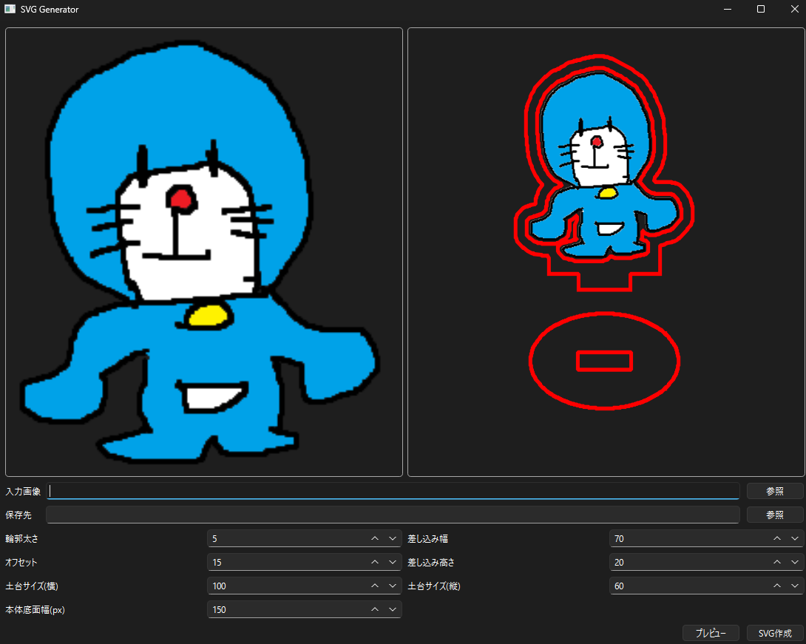

# autocutpath_generator
アクリルスタンドを作成する際のベクターデータ(.svg)を自動で作成するアプリです。

インストールに関して
autocutpath_generator.zipを解凍し、実行する。windowsのセキュリティに引っ掛かるが実行できる。

[!WARNING]
もちろん悪意のあるファイルではないが、何かあった場合は自己責任でお願いします。

## 実行
1. ファイルを実行(もしくはプログラムから実行)するとGUIが立ち上がる

2. 作成したい画像(.png)を指定する。ここで使用する画像は作成したい部分が切り取られている(透過ファイル)前提です。
> 左側に入力画像が表示されます。

3. 出力したいフォルダを選択する

4. プレビューボタンを押すと右側にプレビューが表示されます。

> パラメータを変更した際は、再度プレビューボタンを押すと更新されます。
5. SVG作成ボタンを押すと、指定したフォルダにファイルが保存されます。

##  参考画像

